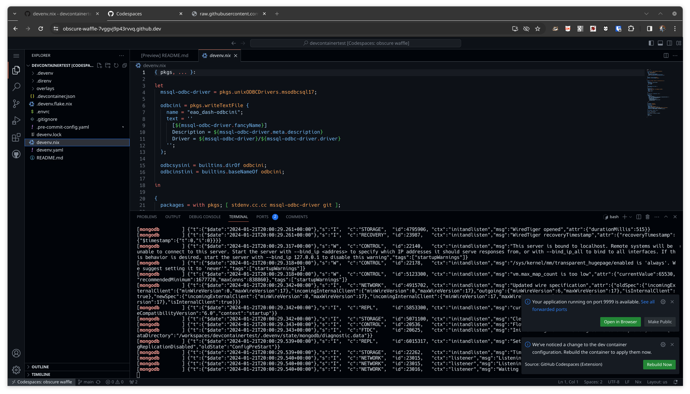

==============================================
 NixOS 69: Using Github Codespaces via Devenv
==============================================

- Companion to video at https://youtu.be/ZhwYh15a8Ls

- This text script available via link in the video description.

- See the other videos in this series by visiting the playlist at
  https://www.youtube.com/playlist?list=PLa01scHy0YEmg8trm421aYq4OtPD8u1SN

Sources
=======

Devenv is a wrapper around Nix that makes it possible to create share
development environment configuration and setup for a team in a cross-platform
way (just about any Linux, MacOS, and WSL2 on Windows).

It also has a feature which automates the creation of a container compatible
with `Github Codespaces <https://github.com/features/codespaces>`_, which makes
it possible to run processes on remote machines and edit a codebase via Visual
Studio Code.

This means that people who are committed to a certain local editing toolchain
(emacs, vim, Sublime Text, etc) can run the project locally, and other possibly
more casual contributors can just fire up a Codespace.

This feature is kinda getting baked at the moment, or at least if you use the
default container supplied by devenv, it may or may not work for your case.
For my needs, I had to generate a new devenv-compatible container and push it
up to a `Github Packages <https://github.com/features/packages>`_ container
registry.  This is the container used by Codespaces to bootstrap the
development environment.  In particular, within the `devenv Dockerfile
<https://github.com/cachix/devenv/blob/main/devcontainer/Dockerfile>`_ supplied
for this purpose, I changed the version of devenv that I wanted to use to one
of my own creation because I wanted to use my own fork of a devenv branch.

When configured via devenv, the container that is run via Codespaces runs
Ubuntu 22.04 and has Nix, devenv, and cachix installed on it.  By default, for
free on Github, you can run at most a four-core/8GB container with 32GB of
storage.  For pay, you can run larger configurations.

To demonstrate to myself that the devenv Codespaces integration worked, I
created a GitHub repository at https://github.com/mcdonc/devcontainertest that
had a devenv configuration.

Here is the ``devenv.nix``:

.. code-block:: nix
                
    { pkgs, ... }:

    let
      mssql-odbc-driver = pkgs.unixODBCDrivers.msodbcsql17;

      odbcini = pkgs.writeTextFile {
        name = "eao_dash-odbcini";
        text = ''
          [${mssql-odbc-driver.fancyName}]
          Description = ${mssql-odbc-driver.meta.description}
          Driver = ${mssql-odbc-driver}/${mssql-odbc-driver.driver}
        '';
      };

      odbcsysini = builtins.dirOf odbcini;
      odbcinstini = builtins.baseNameOf odbcini;

    in

    {
      packages = with pkgs; [ stdenv.cc.cc mssql-odbc-driver git ];

      process = {
        implementation = "process-compose";
        process-compose = {
          tui = "false";
          port = 9999;
        };
      };

      process-managers.process-compose = {
        enable = true;
      };

      languages.python = {
        libraries = with pkgs; [ zlib imagemagick unixODBC ];
        enable = true;
        version = "3.11.7";
        venv = {
          enable = true;
        };
      };

      pre-commit.hooks = { flake8.enable = true; };

      devcontainer= {
        enable = true;
        settings = {
          updateContentCommand = ''
            cachix use devenv;cachix use apex;cachix use nixpkgs-python;devenv ci'';
          image = "ghcr.io/mcdonc/devenv:pyrewrite";
          customizations.vscode.extensions = [
            "ms-python.python"
            "ms-python.vscode-pylance"
            "visualstudioexptteam.vscodeintellicode"
            "jnoortheen.nix-ide"

          ];
        };
      };

      env.ODBCSYSINI = odbcsysini;
      env.ODBCINSTINI = odbcinstini;

      services.postgres = {
        enable = true;
        package = pkgs.postgresql_15;
        initialDatabases = [{ name = "testdb"; }];
        extensions = extensions: [ extensions.postgis extensions.timescaledb ];
        settings.shared_preload_libraries = "timescaledb";
        initialScript = "CREATE EXTENSION IF NOT EXISTS timescaledb;";
      };

      services.mongodb = { enable = true; };

      env.GREET = "devcontainertest";

      # https://devenv.sh/scripts/
      scripts.hello.exec = "echo hello from $GREET";

      enterShell = ''
        hello
        git --version
      '';

    }

And my ``devenv.yaml``:

.. code-block:: nix

    inputs:
      nixpkgs:
        url: github:mcdonc/nixpkgs/nixos-23.11-python-env-venv
      nixpkgs-python:
        url: github:cachix/nixpkgs-python
        inputs:
          nixpkgs:
            follows: nixpkgs
      nix2container:
        url: github:nlewo/nix2container
        inputs:
          nixpkgs:
            follows: nixpkgs
      mk-shell-bin:
        url: github:rrbutani/nix-mk-shell-bin
      devenv:
        url: github:mcdonc/devenv/python-rewrite
      overlays:
        url: path:./overlays
        overlays:
          - default

    allowUnfree: true
    permittedInsecurePackages:
      - openssl-1.1.1w

These configurations are kinda complicated because I'm trying to mirror a
customer environment to ensure it will work for them.  The devenv environment
will run a Postgres server, a MongoDB server, and it will allow processes
running within the environment to contact an MS SQL Server as a client.  In the
"real" customer environment, one or more Python web applications would be
running.

It also uses various forks of ``nixpkgs`` and ``devenv`` to suit my needs.

I first made sure all this stuff worked locally by doing ``devenv shell`` and
``devenv up``.

The first time I invoked ``devenv shell``, by virtue of the ``devcontainer =``
configuration in devenv.nix, it generated a ``.devcontainer.json`` file.  Here
is the Nix code that the json file was generated from:

.. code-block:: nix

    devcontainer= {
      enable = true;
      settings = {
        updateContentCommand = ''
          cachix use devenv;cachix use apex;cachix use nixpkgs-python;devenv ci'';
        image = "ghcr.io/mcdonc/devenv:pyrewrite";
        customizations.vscode.extensions = [
          "ms-python.python"
          "ms-python.vscode-pylance"
          "visualstudioexptteam.vscodeintellicode"
          "jnoortheen.nix-ide"

        ];
      };
    };
                
We use a custom devcontainer image (``ghcr.io/mcdonc/devenv:pyrewrite``), we
specify the command that should be run (``updateContentCommand``) directly
after the container boots, which says we want to use a number of Cachix caches
to prevent recompilation of various packages, and then run ``devenv ci`` which
isn't really strictly necessary, but runs various checks in the environment and
causes packages to be preinstalled from the caches we defined.  We also define
various VSCode extensions that should be installed in the Codespace.

When we run ``devenv shell``, a ``.devcontainer.json`` is generated:

.. code-block:: json

    {
      "customizations": {
        "vscode": {
          "extensions": [
            "ms-python.python",
            "ms-python.vscode-pylance",
            "visualstudioexptteam.vscodeintellicode",
            "jnoortheen.nix-ide"
          ]
        }
      },
      "image": "ghcr.io/mcdonc/devenv:pyrewrite",
      "overrideCommand": false,
      "updateContentCommand": "cachix use devenv;cachix use apex;cachix use nixpkgs-python;devenv ci"
   }
                
After I checked that in and pushed, we are now ready to try to use this
repository via an actual Codespace.

The codespace takes a bit to get created, but once it's up and running, we can
use it like we did locally.  ``devenv shell`` gets us a shell, and
``devenv up`` starts Postgres and MongoDB within the remote container.

I'm pretty happy with this, as it offers kinda the best of both worlds:
hardcore tool-users can develop locally, and less-tool-committed developers
have a chance to contribute via a Codespace.  And since devenv also has a
separate container-generation feature that is more configurable than a
Codespace, we also stand a chance of deploying containers to production rather
than running the system on a VM or raw hardware.

