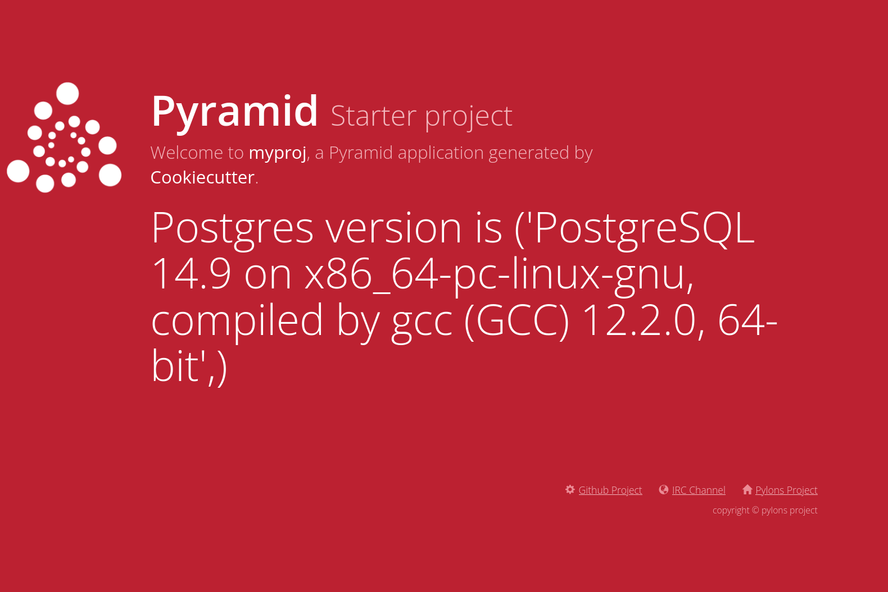

=========================================================================
 NixOS 63: Using ``denvenv`` to Set Up A Python Development Environmnent
=========================================================================

- Companion to video at

- This text script available via link in the video description.

- See the other videos in this series by visiting the playlist at
  https://www.youtube.com/playlist?list=PLa01scHy0YEmg8trm421aYq4OtPD8u1SN

Script
======

`devenv <https://devenv.sh>`_ is a project created by Domen Kozar (there should
be an accent on one of those letters in his last name because it's pronounced
"ko-har", but I'm an American, sorry Domen).  Domen also runs the Cachix Nix
caching service.

``devenv`` allows you to distribute a set of files to a developer, which,
hopefully, once he or she runs one or two commands, will get that developer set
up with a development environment.  By that, I mean that it will run all the
required support services (databases, web servers, your miserable microservice
crap, etc) and the application, and allow the developer to use his own tools in
his normal environment to edit the code and make changes to it.

If the ``devenv`` code is written correctly, the developer will not need to
follow some interminable checklist of fiddly chores to get set up to start
writing and testing code in a working environment.  If she is already running
MacOS or any Linux distribution (even WSL on Windows), she will be able to use
the tools already installed on her machine to edit the code, rather than being
conscripted into using some foreign environment that he or she may not be
comfortable with.

``devenv`` is useful under NixOS but actually more useful under plain-old-Nix.
Because Nix is cross-platform (MacOS and Linux), it is theoretically practical
to use the same set of configuration files to a developer, regardless of
whether he uses one or the other platform.  In particular, a developer needn't
run NixOS to use ``devenv``, and if the configuration scripts are written in a
cross-plaform way, and the developer is on MacOS, he won't need to run the app
in a VM or a container.

``devenv`` uses the concept of a "shell" to do its magic.  When the developer
enters a shell, all of the required support libraries, the software required to
run the application (like databases and languages) get installed.  When the
developer "ups" the development environment, all of the required services are
configured and started.  When the developer is finished, he can shut down the
development environment, and all of the services are stopped.  The support
libraries and services of the development environment are isolated from the
system libraries of the host platform (the magic of Nix).

The ``devenv`` configuration is mostly Nix code, although Domen has tried to
make it possible to confgure some of it via YAML.  But it's just files in
either case. Of course this code can be version controlled and changed over
time to accomodate changes to the configuration requirements of the development
environment.  When something changes about the configuration, the pattern
assumes a developer will "git pull" the ``devenv`` files and rerun the single
command that got him his initial development environment to execute the
required changes.

``devenv`` has support for many languages; I'm going to concentrate in this
video on Python.  I'm (probably inadvisably) also going to configure it using
NixOS, rather than any of the other documented ways on devenv website.

``devenv`` also purportedly allows you to containerize the environment implied
by your configuration; I am not going to talk about that feature in this video,
I haven't even tried it.  Similarly, it allows you to normalize the way you run
tests; haven't tried that either.

Let's Go
========

For purposes of this demo, I've gotten my NixOS set up in flake mode.  THis
requires the following somewhere in the NixOS config:

.. code-block:: nix

  nix = {
    package = pkgs.nixUnstable;
    extraOptions = ''
      experimental-features = nix-command flakes
    '';
  };
  
Once I've done that I can use the flakes mode of ``devenv`` to generate a
project from a template::

  $ cd ~
  $ mkdir devenvtest
  $ cd devenvtest
  $ nix flake init --template github:cachix/devenv
  
This causes a ``flake.nix`` (as well as some hidden files and dirs) to be put
in the current diretory (``devenvtest``).

In order to activate our development environment we use ``nix develop --impure``::

  $ nix develop --impure
  warning: creating lock file '/home/chrism/devenvtest/flake.lock'
  Hello, world!

The devenv tutorial instructs you to use ``devenv up`` to start the services
implicit in the development environment.::

  $ devenv up
  No 'processes' option defined: https://devenv.sh/processes/
 
This doesn't match the tutorial at the moment (it might by the time you're
reading this), but to fix it we need to add this to our ``flake.nix``.

.. code-block:: nix

   processes.run.exec = "hello";

Our resulting ``flake.nix`` will look like this:

.. code-block:: nix

    {
      inputs = {
        nixpkgs.url = "github:NixOS/nixpkgs/nixos-23.05";
        systems.url = "github:nix-systems/default";
        devenv.url = "github:cachix/devenv";
      };

      nixConfig = {
        extra-trusted-public-keys = "devenv.cachix.org-1:w1cLUi8dv3hnoSPGAuibQv+f9TZLr6cv/Hm9XgU50cw=";
        extra-substituters = "https://devenv.cachix.org";
      };

      outputs = { self, nixpkgs, devenv, systems, ... } @ inputs:
        let
          forEachSystem = nixpkgs.lib.genAttrs (import systems);
        in
        {
          packages = forEachSystem (system: {
            devenv-up = self.devShells.${system}.default.config.procfileScript;
          });

          devShells = forEachSystem
            (system:
              let
                pkgs = nixpkgs.legacyPackages.${system};
              in
              {
                default = devenv.lib.mkShell {
                  inherit inputs pkgs;
                  modules = [
                    {
                      # https://devenv.sh/reference/options/
                      packages = [ pkgs.hello ];

                      enterShell = ''
                        hello
                      '';

                      processes.run.exec = "hello";
                    }
                  ];
                };
              });
        };
    }                

Now when we run ``devenv up``, it starts a service::

  $ devenv up
  04:45:35 system | run.1 started (pid=237399)
  04:45:35 run.1  | Hello, world!
  04:45:35 system | run.1 stopped (rc=0)
  
Hello world is nice but let's put some real code in ``flake.nix``.  I want to
run a `tiny web application I created just for the purpose of this demo
<https://github.com/mcdonc/.nixconfig/tree/master/videos/devenv/myproj>`_ .
It's the dumbest possible web app just connecting to Postgres to get its
version number via ``SELECT version()`` and displaying it when you go to its
port via a browser.

The web application obviously depends upon a running Postgres database.  We
will cause the application, its dependent libraries, and all the required
database stuff to be installed within our devenv flake, and we will change it
such that when we start the devenv, it starts the database and our web app.

We will make changes to the devenv flake to:

- Install and configure Postgres.

- Install a version of Python such that everyone doing development is
  using the same one.

- Create a Python virtual environment in which to install the web app.

- Install the web app into the virtualenv.

- When the development environment is started, the web app and postgres will
  start.
  
Here's the new flake file (in the video, I will compose this incrementally):

.. code-block:: nix

    {
      inputs = {
        nixpkgs.url = "github:NixOS/nixpkgs/nixos-23.05";
        systems.url = "github:nix-systems/default";
        devenv.url = "github:cachix/devenv";
        nixpkgs-python.url = "github:cachix/nixpkgs-python";
      };

      nixConfig = {
        extra-trusted-public-keys = "devenv.cachix.org-1:w1cLUi8dv3hnoSPGAuibQv+f9TZLr6cv/Hm9XgU50cw=";
        extra-substituters = "https://devenv.cachix.org";
      };

      outputs = { self, nixpkgs, devenv, systems, nixpkgs-python, ... } @ inputs:
        let
          forEachSystem = nixpkgs.lib.genAttrs (import systems);
        in
        {
          packages = forEachSystem (system: {
            devenv-up = self.devShells.${system}.default.config.procfileScript;
          });

          devShells = forEachSystem
            (system:
              let
                pkgs = nixpkgs.legacyPackages.${system};
              in
              {
                default = devenv.lib.mkShell {
                  inherit inputs pkgs;
                  modules = [
                    {
                      # https://devenv.sh/reference/options/
                      packages = [
                        pkgs.python311Packages.psycopg2
                      ]; # XXX pkgs?

                      services.postgres = {
                        enable = true;
                        initialDatabases = [{ name = "mydb"; }];
                        settings = {
                          unix_socket_directories = "/tmp";
                        };
                      };

                      languages.python = {
                        enable = true;
                        version = "3.11.3";
                        venv = {
                          enable = true;
                          quiet = true;
                        };
                      };

                      enterShell = ''pip install -e ./myproj'';

                      processes.myapp.exec = "pserve myproj/development.ini";
                    }
                  ];
                };
              });
        };
    }

Then I put the code that's in
https://github.com/mcdonc/.nixconfig/tree/master/videos/devenv/myproj into our
``~/devenvtest`` directory; the new flake changes rely on that.

After our changes, running ``nix develop --impure`` to get us into a devenv
shell does this::

    $ nix develop --impure
    Obtaining file:///home/chrism/projects/devenv_test/myproj
      Preparing metadata (setup.py) ... done
    Requirement already satisfied: plaster_pastedeploy in ./.devenv/state/venv/lib/python3.11/site-packages (from myproj==0.0) (1.0.1)
    Requirement already satisfied: pyramid in ./.devenv/state/venv/lib/python3.11/site-packages (from myproj==0.0) (2.0.2)
    Requirement already satisfied: pyramid_chameleon in ./.devenv/state/venv/lib/python3.11/site-packages (from myproj==0.0) (0.3)
    Requirement already satisfied: pyramid_debugtoolbar in ./.devenv/state/venv/lib/python3.11/site-packages (from myproj==0.0) (4.10)
    Requirement already satisfied: waitress in ./.devenv/state/venv/lib/python3.11/site-packages (from myproj==0.0) (2.1.2)
    Requirement already satisfied: psycopg2 in /nix/store/f5n0rfq5plb3nn855hmmimf1wrkfx6a6-devenv-profile/lib/python3.11/site-packages (from myproj==0.0) (2.9.5)
    Requirement already satisfied: PasteDeploy>=2.0 in ./.devenv/state/venv/lib/python3.11/site-packages (from plaster_pastedeploy->myproj==0.0) (3.1.0)
    Requirement already satisfied: plaster>=0.5 in ./.devenv/state/venv/lib/python3.11/site-packages (from plaster_pastedeploy->myproj==0.0) (1.1.2)
    Requirement already satisfied: hupper>=1.5 in ./.devenv/state/venv/lib/python3.11/site-packages (from pyramid->myproj==0.0) (1.12)
    Requirement already satisfied: setuptools in ./.devenv/state/venv/lib/python3.11/site-packages (from pyramid->myproj==0.0) (65.5.0)
    Requirement already satisfied: translationstring>=0.4 in ./.devenv/state/venv/lib/python3.11/site-packages (from pyramid->myproj==0.0) (1.4)
    Requirement already satisfied: venusian>=1.0 in ./.devenv/state/venv/lib/python3.11/site-packages (from pyramid->myproj==0.0) (3.1.0)
    Requirement already satisfied: webob>=1.8.3 in ./.devenv/state/venv/lib/python3.11/site-packages (from pyramid->myproj==0.0) (1.8.7)
    Requirement already satisfied: zope.deprecation>=3.5.0 in ./.devenv/state/venv/lib/python3.11/site-packages (from pyramid->myproj==0.0) (5.0)
    Requirement already satisfied: zope.interface>=3.8.0 in ./.devenv/state/venv/lib/python3.11/site-packages (from pyramid->myproj==0.0) (6.1)
    Requirement already satisfied: Chameleon in ./.devenv/state/venv/lib/python3.11/site-packages (from pyramid_chameleon->myproj==0.0) (4.4.0)
    Requirement already satisfied: pyramid-mako>=0.3.1 in ./.devenv/state/venv/lib/python3.11/site-packages (from pyramid_debugtoolbar->myproj==0.0) (1.1.0)
    Requirement already satisfied: Pygments in ./.devenv/state/venv/lib/python3.11/site-packages (from pyramid_debugtoolbar->myproj==0.0) (2.17.2)
    Requirement already satisfied: Mako>=1.1.0 in ./.devenv/state/venv/lib/python3.11/site-packages (from pyramid-mako>=0.3.1->pyramid_debugtoolbar->myproj==0.0) (1.3.0)
    Requirement already satisfied: MarkupSafe>=0.9.2 in ./.devenv/state/venv/lib/python3.11/site-packages (from Mako>=1.1.0->pyramid-mako>=0.3.1->pyramid_debugtoolbar->myproj==0.0) (2.1.3)
    Installing collected packages: myproj
      Attempting uninstall: myproj
        Found existing installation: myproj 0.0
        Uninstalling myproj-0.0:
          Successfully uninstalled myproj-0.0
      Running setup.py develop for myproj
    Successfully installed myproj-0.0

Running ``devenv up`` within the resulting shell gives us this::

    $ devenv up
    04:56:58 system     | myapp.1 started (pid=244844)
    04:56:58 system     | postgres.1 started (pid=244846)
    04:56:58 postgres.1 | 
    04:56:58 postgres.1 | PostgreSQL database directory appears to contain a database; Skipping initialization
    04:56:58 postgres.1 | 
    04:56:58 postgres.1 | 2023-12-14 09:56:58.161 GMT [244849] LOG:  starting PostgreSQL 14.9 on x86_64-pc-linux-gnu, compiled by gcc (GCC) 12.2.0, 64-bit
    04:56:58 postgres.1 | 2023-12-14 09:56:58.162 GMT [244849] LOG:  listening on Unix socket "/tmp/.s.PGSQL.5432"
    04:56:58 postgres.1 | 2023-12-14 09:56:58.164 GMT [244852] LOG:  database system was shut down at 2023-12-14 09:56:48 GMT
    04:56:58 postgres.1 | 2023-12-14 09:56:58.168 GMT [244849] LOG:  database system is ready to accept connections
    04:56:58 myapp.1    | Starting server in PID 244848.
    04:56:58 myapp.1    | 2023-12-14 04:56:58,596 INFO  [waitress:486][MainThread] Serving on http://[::1]:6543
    04:56:58 myapp.1    | 2023-12-14 04:56:58,597 INFO  [waitress:486][MainThread] Serving on http://127.0.0.1:6543
  
The app is now running on http://localhost:6543/ .  Visiting it gives us this.

The webapp sucks but the important bit: Python is talking to Postgres, and the
database and the webapp are indeed running.  Conversely, If we press ctrl-C,
postgres and the webapp stop.  When we exit the devenv shell, we are back to
our normal world.

Why not use pure Nix instead of using ``devenv``?  Nix touts itself as a tool
useful to developers, right?  Welp, to be honest, I've never really used bare
Nix in anger.  But I know that replicating the convenience of what ``devenv``
gave us in this video might be tricky in NixOS, so probably even trickier in
bare Nix.  I think the question may be above my pay grade, because I'm frankly
unwilling to put in the work to find out how hard this would be without devenv,
cuz devenv exists.

