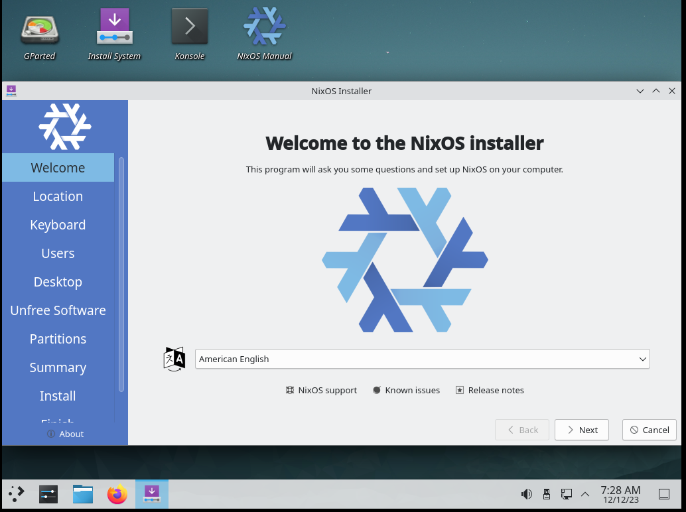

============================================================
 NixOS 63: Install NixOS 23.11 and Use Flakes Out Of the Box
============================================================

- Companion to video at

- This text script available via link in the video description.

- See the other videos in this series by visiting the playlist at
  https://www.youtube.com/playlist?list=PLa01scHy0YEmg8trm421aYq4OtPD8u1SN

Script
======

NixOS has a bit of a split personality.  Out of the box, when you install it
fresh, it is configured in a mode that will soon become legacy.

The "legacy" mode is the use of a single ``/etc/nixos/configuration.nix`` file
that houses all the information about your system.  It's quite cool and it
works, but pretty soon (probably within the next six months to a year), this
mode of configuration will become deprecated.

What will take its place?  A file named ``/etc/nixos/flake.nix``.  When this
file exists on your system, and you put some ``nix``-the-command related hair
in your configuration, it builds the system differently.  In particular,
instead of using `channels <https://nixos.wiki/wiki/Nix_channels>`_, it becomes
possible to use package inputs that you specify in the ``/etc/nixos/flake.nix``
file instead.

One of the cool features of NixOS is being able to totally repeatably build a
system.  Want to deploy a similar configuration across two or twenty systems?
Totally doable with NixOS.  But when you use channels, it's more difficult to
repeat an older, woking build on one system, or repeat exactly the same build
across a number of systems because once you update a channel, you can't easily
un-update it, and you're stuck moving forward with package changes implied by
the new channel data.  Channel data is updated over time, so the build you
deploy to one system, due to the passage of time until you get around to the
next one, may not be exactly the same as the first.

With flakes, on the other hand, a ``flake.lock`` file controls which version of
``nixpkgs`` (the huge software repository) you're using, and you can move back
in time if something breaks, and you can ensure all your systems have exactly
the same set of software.

There are various ways around the update problem without using flakes, but
flakes are the futureproof way to avoid it from the start.  The code that
implements flakes is being written by the core NixOS team, and it is a *fait
accompli* that it will eventually be the default configuration mechanism.

One downside of using NixOS in flakes mode is a paucity of beginner
documentation.  NixOS is hard to learn.  You have to learn a new language, and
learn how to apply that language to get done the things that need to be done.
Most beginner NixOS docs don't yet mention flakes, so you may get stuck.  If
you use flakes out of the box, you'll need to be willing to visit the NixOS
Matrix channel or its Discourse website to ask questions when this happens.
But to be honest, this will be true even if you *don't* use flakes anyway, so
why not?  Also, it's all just Nix-the-language anyway, so you won't miss out on
much by deciding to use flakes; all the knowledge you gain will be applicable
to both modes.

Another downside of using NixOS in flakes mode is that you will have to know at
least a few Git commands, and you'll have to be willing to use Git to version
control your NixOS configuration files.

So, while it may be a lot to take on board, especially as a new NixOS user, in
this weird interregnum between the retiring of ``configuration.nix`` and the
ascendance of ``flake.nix``, I'd suggest using flakes, if only because it truly
is better than the legacy system, particularly if you want to reuse a
configuration across multiple systems.

I'm going to describe how to install NixOS for the first time, and get set up
in a flakes regime right from the start, so you don't eventually need to
convert your system to use flakes when it becomes the default.

Demo
====

Using a `NixOS 23.11 ISO <https://nixos.org/download#nixos-iso>`_, install
NixOS via the GUI installer.  There are two versions of the ISO, one that uses
KDE Plasma, and the other that uses Gnome to present the installer GUI.  The
existence of both is semi-pointless, because you can choose to install either
KDE or Gnome (or a variety of other desktop environments) into your "real"
environment using either install ISO.

In this demo I'm using the Plasma version.

Once the installer has finished, reboot.

Start a terminal.

Change the ownership of the ``/etc/nixos`` directory and the files it contains
such that your "normal" user can read and write to stuff within it::

  $ cd /etc/nixos
  $ sudo chown -R chrism:users .

Set up the configuration hair that enables flakes-related commands in your
``configuration.nix`` using ``nano`` in a terminal (it's the only editor on the
system right now).  Add this stanza anywhere before the final closing curly
brace of the file, but after its paired opening brace.

.. code:: nix

  nix = {
    package = pkgs.nixUnstable;
    extraOptions = ''
      experimental-features = nix-command flakes
    '';
  };

Add ``git`` and your favorite editor to ``environment.systemPackages`` within
``configuration.nix``::

  environment.systemPackages = with pkgs; [
    git
    emacs
  ];

If you are installing a virtual machine, this line will start a service that
allows you to cut and paste between your host machine and the NixOS guest
(requires a reboot of the guest after a rebuild)::

  services.spice-vdagentd.enable = true;

Make sure your system is connected to the internet (Wifi, whatever).

Rebuild the system::

  $ sudo nixos-rebuild switch

Do some configuration of Git so it works when we use it::

  $ git config --global user.email "chrism@plope.com"
  $ git config --global user.name "Chris McDonough"

You are now ready to convert this working installation to flakes.

The flake regime requires that all of your configuration files live inside a
version control repository.  Create a git repository within ``/etc/nixos``::

  $ cd /etc/nixos
  $ git init

Create ``/etc/nixos/flake.nix``.

.. code:: nix

    {
      description = "My flakes configuration";

      inputs = {
        nixpkgs.url = "github:NixOS/nixpkgs/nixos-23.11";
      };

      outputs = { self, nixpkgs }@inputs:
        {
          nixosConfigurations = {
            nixos = nixpkgs.lib.nixosSystem {
              system = "x86_64-linux";
              modules = [ ./configuration.nix];
            };
          };
        };
    }

See "nixos = nixpkgs.lib.nixosSystem" there?  that says "use this configuration
for a system with the *hostname* ``nixos``, which by default is the hostname
given to a new system created by the installer (changeable in
``/etc/nixos/configuration.nix``) .  If you want to add another machine to your
configuration in the future, you can just give it a different hostname, and
refer to slightly different configurations for different systems in
``flake.nix``, e.g.:

.. code:: nix

      outputs = { self, nixpkgs }@inputs:
        {
          nixosConfigurations = {
            nixos = nixpkgs.lib.nixosSystem {
              system = "x86_64-linux";
              modules = [ ./configuration.nix];
            };
            myothersystem = nixpkgs.lib.nixosSystem {
              system = "x86_64-linux";
              modules = [ ./configuration.nix ./moreconfig.nix];
            };
          };
        };
          
  
Try to run ``sudo nixos-rebuild switch``.  It will fail with an inscrutable
error::

  warning: Git tree '/etc/nixos' is dirty
  error: getting status of '/nix/store/0ccnxa25whszw7mgbgyzdm4nqc0zwnm8-source/flake.nix': No such file or directory

But note that the *presence* of ``/etc/nixos/flake.nix`` means we are now
attemting to build in flakes mode, and the error is an indication of that
(legacy mode requires no version control).

``flake.nix`` needs to be added to version control to be findable::

  $ git add flake.nix

Try to run ``sudo nixos-rebuild switch``.  It will fail again with the same
inscrutable error, but this time for ``configuration.nix``::

     error: getting status of '/nix/store/2hxl17pfyqd6d86sv3cyvra2bfa7gr5p-source/configuration.nix': No such file or directory

``configuration.nix`` was generated during our install process and wwe refer to
it in our ``flake.nix``.  It needs to be added to version control.  It, in turn
refers to ``hardware-configuration.nix``, which likewise needs to be added::

  $ git add configuration.nix hardware-configuration.nix

Try to run ``sudo nixos-rebuild switch``.  It will succeed.

You're now using NixOS in flakes mode.

Check in all the files you added to version control::

  $ git commit -a -m "convert to flakes"
  
If you like, you can `import your /etc/nixos Git repository into GitHub
<https://www.wikihow.com/Import-a-Repository-on-Github>`_ to share it with
other people, or just to keep it somewhere safe in case your hard disk crashes.
You can of course revert to any commit in the repository and run
``nixos-rebuild`` to get back to an older state.

Over time, to update the software that's installed on your machine, we can use
``nix flake update`` and a rerun of ``nixos-rebuild switch``::

  $ nix flake update
  $ sudo nixos-rebuild switch

This will change ``flake.lock`` and you can choose to commit it if everything
worked ok or revert it if things went pear shaped after the rebuild.  If you
revert it, just run ``sudo nixos-rebuild switch`` again and you will be back at
the state the machine was at before you updated the flake and rebuilt.

This replaces the legacy regime's command::

  $ sudo nixos-rebuild switch --upgrade

Let's revisit ``/etc/nixos/flake.nix``:

.. code:: nix

    {
      description = "My flakes configuration";

      inputs = {
        nixpkgs.url = "github:NixOS/nixpkgs/nixos-23.11";
      };

      outputs = { self, nixpkgs }@inputs:
        {
          nixosConfigurations = {
            nixos = nixpkgs.lib.nixosSystem {
              system = "x86_64-linux";
              modules = [ ./configuration.nix];
            };
          };
        };
    }

See "nixos = nixpkgs.lib.nixosSystem" there?  that says "use this configuration
for a system with the *hostname* ``nixos``, which by default is the hostname
given to a new system created by the installer, and which is changeable in
``/etc/nixos/configuration.nix``.  If you want to add another machine to your
configuration in the future, you can just give it a different hostname, and
refer to slightly different configurations for different systems in
``flake.nix``, e.g.:

.. code:: nix

      outputs = { self, nixpkgs }@inputs:
        {
          nixosConfigurations = {
            nixos = nixpkgs.lib.nixosSystem {
              system = "x86_64-linux";
              modules = [ ./configuration.nix];
            };
            myothersystem = nixpkgs.lib.nixosSystem {
              system = "x86_64-linux";
              modules = [ ./configuration.nix ./moreconfig.nix];
            };
          };
        };
          
Then run nixos-rebuild on the host you named ``myothersystem`` and it will have
all the configuration implied by both ``configuration.nix`` and
``moreconfig.nix``.  Rinse and repeat for every system in your life.  Allowing
systems to share the same configuration this way is one of the benefits of
flakes-based configuration.

  
Blather
=======

I'm not going to go into making other changes to ``flake.nix``.  Plenty of
YouTube videos, blog entries, and other resources are available for that.  But
we can see that flakes-based configuration is really just a layer on top of the
legacy configuration service; one which can use files
(e.g. ``configuration.nix`` and ``hardware-configuration.nix``) that were
generated under the old configuration regime.

I've been talking as if ``flake.nix`` is a feature only useful to configure
NixOS.  It is actually a much more general system, and can be used to build
projects other than NixOS.  Nix developers are, as we speak, busy creating
registries of flakes that build software and services by just feeding a URL to
the ``nix run`` command.

For example, you can install a MacOS X Ventura virtual machine by doing::

  nix run github:matthewcroughan/NixThePlanet#macos-ventura

Under the hood, that uses a flake.

