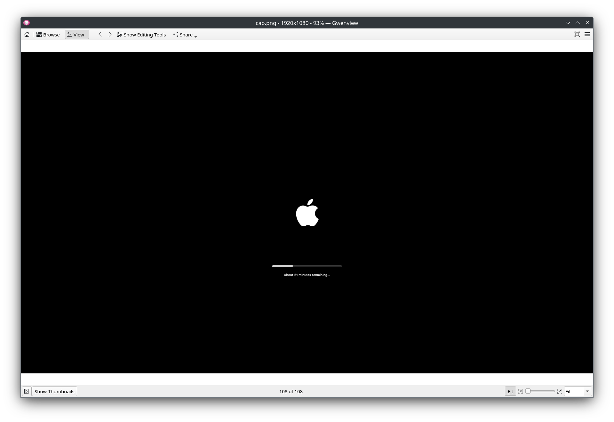

====================================================================
 NixOS 62: Run MacOS X on NixOS With a Single Command (NixThePlanet)
====================================================================

- Companion to video at

- This text script available via link in the video description.

- See the other videos in this series by visiting the playlist at
  https://www.youtube.com/playlist?list=PLa01scHy0YEmg8trm421aYq4OtPD8u1SN

Script
======

`Matthew Croughan <https://github.com/MatthewCroughan>`_ has made it possible
to get MacOS Ventura installed within a virtual machine on a NixOS host with a
single command via his `NixThePlanet
<https://github.com/MatthewCroughan/NixThePlanet/tree/master>`_ project.

.. code:: shell

   nix run github:matthewcroughan/NixThePlanet#macos-ventura

The way this thing works under the hood is remarkable.  It scrapes the screen
through OCR every so often, and sends programmatic mouse clicks via VNC to
drive the install process after downloading the proper MacOS image from Apple.
It's demented and wonderful.

Personally, I did not actually use the above command.  Instead I added the
NixThePlanet github repo to my flake inputs:

.. code:: nix

   nixtheplanet.url = "github:matthewcroughan/NixThePlanet";

And added the ``nixtheplanet.nixosModules.macos-ventura`` module to my flake's
modules list.

Then I added the ``macos-ventura`` service to my configuration:

.. code:: nix

  services.macos-ventura = {
    enable = true;
    openFirewall = true;
    vncListenAddr = "0.0.0.0";
  };

and rebuilt.  It takes quite a while for the process to complete; on the order
of an hour or two.  But once you rebuild sucessfully, the new VM can be
contacted via VNC on ``localhost:5900``. I use the program KRDC to contact it.

Once you contact it, the username and password is ``admin``, ``admin``.

.. code:: shell

    $ nix --extra-experimental-features nix-command flakes build --out-link /tmp/nixos-rebuild.8XJCAm/nixos-rebuild /home/chrism/.nixconfig#nixosConfigurations."thinknix512".config.system.build.nixos-rebuild --verbose --show-trace
    warning: Git tree '/home/chrism/.nixconfig' is dirty
    $ exec /nix/store/fpr71zwhdbnqmax2c898skbj8b6am5j4-nixos-rebuild/bin/nixos-rebuild switch --verbose --show-trace
    building the system configuration...
    Building in flake mode.
    $ nix --extra-experimental-features nix-command flakes build /home/chrism/.nixconfig#nixosConfigurations."thinknix512".config.system.build.toplevel --verbose --show-trace --out-link /tmp/nixos-rebuild.vTShYe/result
    warning: Git tree '/home/chrism/.nixconfig' is dirty
    these 7 derivations will be built:
      /nix/store/hvlp2x19bjjn511a3s26flzb5wqrmmji-qemu-host-cpu-only-8.1.3.drv
      /nix/store/wr9yzgfqhywrlvic6jzhzjy4a7y5ckf0-mac_hdd_ng.qcow2.drv
      /nix/store/qh0hf51d1i0pwxacq1kliwm3pr4qsl3j-run-macOS.sh.drv
      /nix/store/5izqwi6jrwrncvxdl12lmwzg4a88d5mn-unit-macos-ventura.service.drv
      /nix/store/hpj5d6x32zp6h9hiqp66h5miyc4fwqs4-system-units.drv
      /nix/store/f0f8qnkr99yq29ccmrfpim5g62zbdii3-etc.drv
      /nix/store/9wdmwvh50i70n39qvixv55lpx8jg1h49-nixos-system-thinknix512-23.11.20231207.b4372c4.drv
    building '/nix/store/hvlp2x19bjjn511a3s26flzb5wqrmmji-qemu-host-cpu-only-8.1.3.drv'...
    building '/nix/store/wr9yzgfqhywrlvic6jzhzjy4a7y5ckf0-mac_hdd_ng.qcow2.drv'...
    [1/1/7 built] building mac_hdd_ng.qcow2: ‘About 29 minutes remaining          

For fun, check out the constantly-changing ``cap.png`` image in
``/tmp/nix-build-mac_hdd_ng.qcow2.drv-0/tmp.*`` while it installs (root
required).  It is taking a screenshot of the install process every few seconds,
OCR-ing it, and if the text changes, decides what VNC command to send to it
next.  Fun.

         
You can stop the VM via ``systemctl stop macos-ventura``.  Note that it will be
started again on the next reboot or ``nixos-rebuild``.  But you can disable the
service in your config if you don't want it running all the time; it will not
need to rebuild the image if you reenable it.

NixThePlanet also allows you to install various ancient Windows versions as
well as DOS.
