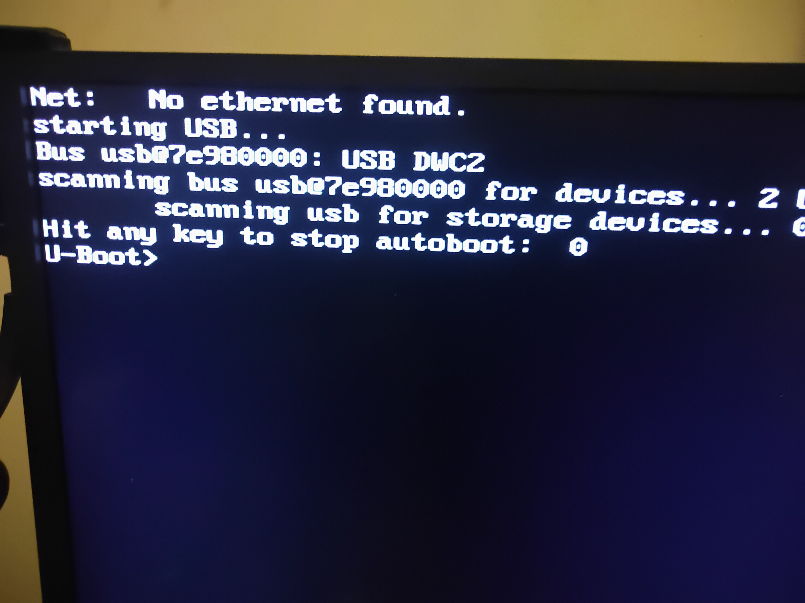
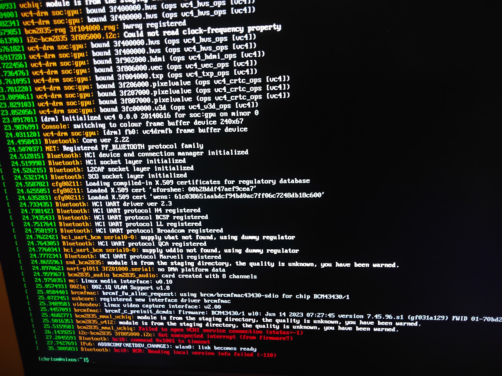

=========================================================
NixOS 72: Building a NixOS Image for Raspberry Pi, Part 1
=========================================================

The first thing that comes up when you search for "raspberry pi nixos" will
probably be https://nixos.wiki/wiki/NixOS_on_ARM/Raspberry_Pi .  It is a mess,
like all documentation maintained in a wiki (except for Arch's, respect). It
talks about prebuilt images, and that's attractive, because it mirrors a
familiar experience that other Linux distros for Pi deliver.  But we use Nix,
and we don't need no stinking prebuilt image.  The whole point of Nix is
repeatable builds. Let's build our own, if only to avoid needing to read that
trainwreck of a wiki page.

I'll be using a NixOS system to build my RPi image, but I don't think it's
strictly necessary.  It is reportedly possible to use Nix running on Ubuntu or
MacOS to do the compilation, although I'll need to wait until part 2 of this series to try it.

Strategy
========

I'll be cross-compiling to ARM via an ``x86_64`` host. Initially I was leery of
this, because my experiences cross-compiling using other host operating systems
have always been full of pain, but it's a bit of a nonissue with Nix. You set a
couple of flags in the Nix config of the system you'd like to build, and it
takes care of the rest.

I don't have any powerful ARM devices available.  Compiling new software from
source takes a lot of CPU and all the RPis I have would struggle were I try to
use them to build NixOS. I'm going to use a Pi Zero 2 W initially.  My Pi Zero 2
wouldn't even be able to finish compiling certain packages due to lack of RAM.
Cross-compiling avoids both of these problems, and it's reasonably fast.

This is also a problem for updates.  After the system is installed, I'll try to
use a tool named `deploy-rs` to cross compile updates on our host system and
deploy it to our running RPi without needing to rebuild an image from scratch.

NixOS ARM Architecture & Platform Support
==========================================

NixOS support from newest to oldest ARM architecture is as follows.

``aarch64``
------------

Pi 3/4/5, Pi Zero 2/2W.  64-bit.  Supported by NixOS well.  The wiki claims that
normal cache.nixos.org binary cache has most Nix packages in it but I found this
to be false; lots of compiling must be done.

``armv7l``
----------

Pi 2.  32-bit.  Supported pretty well by nixos-23.11 but nixpkgs-unstable
already has some incompatibilities that cause compilation to fail.
cache.nixos.org cdoesn't have any v7 packages in it, so you'll be compiling
everything.

``armv6l``
---------

Pi 1, Pi Zero.  32 bit. Not supported anymore under NixOS as a compilation
target, at least not in the same way as newer Raspberry Pi architectures are.

The Test System
===============

I'm going to use a Raspberry Pi Zero 2 W as my target, but the image I build
should be compatible with any ``aarch64`` Raspberry Pi that's been released up
until now: Pi 3, Pi 3+, Pi 4, and Pi 5.  I haven't tried it on any of those
other devices, but research indicates that there aren't any required
configuration differences for basic functionality other than possibly needing to
mess with ``linuxPackages.<otherlinux-version>`` to get some specific kernel
features. Let me know if you try it and find otherwise before I release part 2
of this series.

The creation of an RPi-compatible ``aarch64`` ISO image took about two and a
half hours on my system after I issued the command to build it.  There's
probably some set of third-party caches I could use to reduce the time. I didn't
try very hard to look for them, but I did use `Cachix <https://cachix.org>`_ to
cache the results of my builds, so I won't need to recompile next time I want to
build an image.

I had also intended to get NixOS working on an original Pi Zero, but I punted.
Modern NixOS has largely ditched ``armv6``.  I could probably get it running by
pinning nixpkgs to an older revision, but I would subsequently lack the patience
to update the system to a very recent set of packages.  If I want to use an
original Pi 1 or Pi Zero, I'll use RPi OS instead of NixOS.

What I've tested: booting, updating, HDMI, and wireless.

What I've not tested: GPIO, USB, Ethernet, sound, Bluetooth, or any desktop UI.
The GPIO is blown out on my Zero 2 W. Since it's a Zero, it doesn't have sound
or Ethernet either.  I'll locate a more powerful and less-broken Pi for part 2 of this video and try those things.

Design Caveats
==============

Apparently, due to the the way the image is built, it's not possible to edit the
settings that you might put in the RPi-OS ``config.txt`` without regenerating
the image.

Building the Image
==================

The repository I'm using is at https://github.com/mcdonc/nixos-pi-zero-2 .  This
is a trivial fork of https://github.com/plmercereau/nixos-pi-zero-2 in which
``plmercereau`` did all the heavy lifting.  My fork just updates the
cross-compilation flags so it works with modern Nix tools.  Despite the
repository's name, the image it generates is likely to work on any ``aarch64``
Pi system.

.. note::

   If you are not running NixOS on the system you're using to build the image,
   and my repository does not work, you might be interested in looking at
   https://github.com/pete3n/nix-pi?tab=readme-ov-file which works harder to
   support a variety of buildhost systems at the cost of more complexity.

Clone my repository and change the Wifi and user information in the
``zero2w.nix`` file. Make sure to add your SSH public key to your user definition.

Then give the command to build the image within the cloned repository:

.. code-block:: bash

   nix --experimental-features 'nix-command flakes' build \
     -L ".#nixosConfigurations.zero2w.config.system.build.sdImage"

When it's done building, burn the resulting image to your SD card:

.. code-block:: bash

   DEVICE=/dev/disk5 # Whatever your sd card reader is
   sudo dd if=result/sd-image/zero2.img of=$DEVICE bs=1M conv=fsync \
     status=progress

Jam it into your Pi and start it up.

Booting the Image
=================

HDMI works.  I'm not sure if it's my keyboard hardware, but I actually have to
type "boot" at the U-Boot prompt to get the system to boot.

NixOS indeed boots.  Some messages indicating Bluetooth isn't happy are sprayed to the console.

I can indeed ping the system and ssh to the system once it boots.

Trying to Update The System Using ``deploy-rs``
===============================================

Let's try to update the system after making a trivial change to our
configuration in our checked out repo.  We can't really use the Pi Zero 2 to
build that stuff because a) it has no ``/etc/nixos`` at the moment and b) it
doesn't have much RAM.  But we can try to do it remotely using the ``deploy-rs``
tool.  This tool can update running systems remotely without the system needing
to do much heavy lifting.

My Pi wound up with the IP address 192.168.1.208, so I'll use that as the
``hostname`` parameter to ``deploy-rs``.

.. code-block:: bash

   $ ZERO2_IP=192.168.1.208
   $ SSH_USER=chrism
   $ nix run github:serokell/deploy-rs ".#zero2w" -- --ssh-user $SSH_USER \
     --hostname $ZERO2_IP

Unfortunately, this does not work when the host system is ``x86_64``, at least with the flags I've given it.

.. code-block:: bash

   $ nix run github:serokell/deploy-rs ".#zero2w" -- --ssh-user $SSH_USER \
      --hostname $ZERO2_IP

   🚀ℹ️ [deploy] [INFO] Running checks for flake in .
   warning: Git tree '/home/chrism/projects/nixos-pi-zero-2' is dirty
   warning: unknown flake output 'deploy'
   🚀 ℹ️ [deploy] [INFO] Evaluating flake in .
   warning: Git tree '/home/chrism/projects/nixos-pi-zero-2' is dirty
   🚀 ℹ️ [deploy] [INFO] The following profiles are going to be deployed:
   [zero2w.system]
   user = "root"
   ssh_user = "chrism"
   path = "/nix/store/2j3ailhyk8bhfdi7xfr38r094gvpir54-activatable-nixos-system-nixos-24.05.20240221.0e74ca9"
   hostname = "zero2w"
   ssh_opts = []
   🚀 ℹ️ [deploy] [INFO] Building profile `system` for node `zero2w`
    error: a 'aarch64-linux' with features {} is required to build '/nix/store/wymwbldiha4rn0ynmgz2xs8myqyrygym-builder.pl.drv', but I am a 'x86_64-linux' with features {benchmark, big-parallel, kvm, nixos-test}
   🚀 ❌ [deploy] [ERROR] Failed to push profile: Nix build command resulted in a bad exit code: Some(1)

An alternate mechanism is reportedly to use ``--target-host`` and
``--target-user`` as flags to ``nixos-rebuild`` but a) this reportedly only
works if the host you're using runs NixOS and b) I have no set of files yet for
``nixos-rebuild`` to run against.

Conclusions
===========

It works, mostly!  I'll research the runtime issues I've unearthed, as well as
try to verify my claims that the same image can be used on multiple RPi devices,
and I'll confirm or disconfirm that a non-NixOS host can be used to generate
images and to update the system in Part 2.
